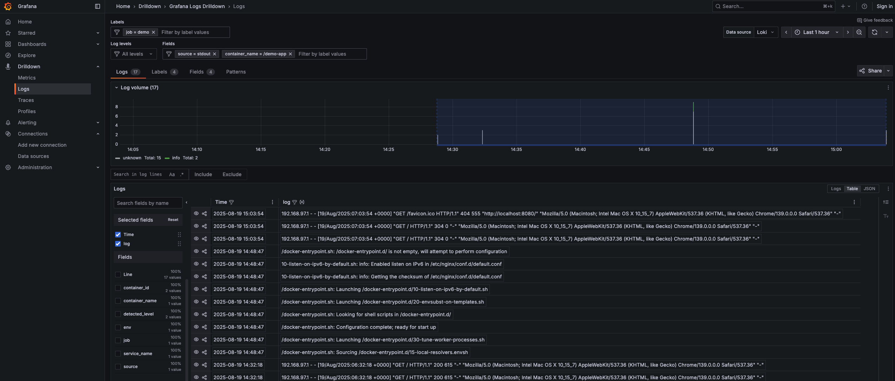

# Fluentd to Loki

Collect application logs using Fluentd and send them to Loki for storage and visualization with Grafana.



## Components

- **Fluentd**: Log collector that forwards logs to Loki
- **Loki**: Log aggregation system for storing logs
- **LogCLI**: Command-line tool for querying Loki
- **Grafana**: Visualization dashboard for viewing logs
- **Demo App**: Nginx container that generates sample logs

## Quick Start

1. Start the entire stack:
```bash
docker-compose up -d
```

2. Generate some logs by visiting the demo app:
```bash
curl http://localhost:8080
```

3. View logs in Grafana:
   - Open http://localhost:3000 in your browser
   - Loki datasource is pre-configured
   - Visit http://localhost:3000/a/grafana-lokiexplore-app/explore to search logs

4. Query labels in Loki:
```bash
docker-compose exec -it lokicli /bin/sh -c "logcli labels --addr=http://loki:3100"
```

## Services & Ports

| Service | Port | Description |
|---------|------|-------------|
| Demo App | 8080 | Nginx demo application |
| Fluentd | 24224 | Log collection endpoint |
| Loki | 3100 | Log storage API |
| Grafana | 3000 | Web dashboard |

## Configuration

- **Fluentd**: Configured to receive logs on port 24224 and forward to Loki
- **Demo App**: Uses Fluentd logging driver to send logs
- **Grafana**: Auto-configured with Loki datasource
