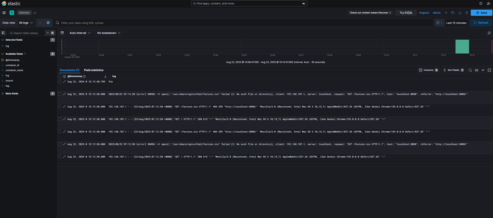

# Fluentd to Elasticsearch

Collect application logs using Fluentd and send them to Elasticsearch for storage and analysis with Kibana visualization.



## Components

- **Fluentd**: Log collector that forwards logs to Elasticsearch
- **Elasticsearch**: Log aggregation and analysis platform (v8.19.2)
- **Kibana**: Web interface for visualizing and exploring logs (v8.19.2)
- **Demo App**: Nginx container that generates sample logs

## Quick Start

1. Start the entire stack:
```bash
docker-compose up -d
```

2. Generate some logs by:
```bash
# visiting the demo app
curl http://localhost:8080

# send log via fluentd
curl -X POST -d 'json={"log":"foo"}' http://localhost:9880/app.log
```

3. View logs in Kibana or Elasticsearch:
   - **Kibana Web UI**: Visit `http://localhost:5601` for visual log exploration
   - **Elasticsearch API**: Access `http://localhost:9200`
   - View all indices: `curl http://localhost:9200/_cat/indices`
   - Search for logs using Elasticsearch Query DSL

4. Search logs in Elasticsearch:
   - Use search queries like: `curl http://localhost:9200/logs-*/_search` or `curl http://localhost:9200/logs-*/_search?q=message:foo`

## Services & Ports

| Service | Port | Description |
|---------|------|-------------|
| Demo App | 8080 | Nginx demo application |
| Fluentd | 24224 | Log collection endpoint |
| Fluentd | 9880 | HTTP endpoint for direct log submission |
| Elasticsearch | 9200 | Elasticsearch HTTP API |
| Kibana | 5601 | Kibana web interface |

## Configuration

- **Fluentd**: Configured to receive logs on port 24224 (forward protocol) and 9880 (HTTP) and forward to Elasticsearch with logstash format (logs-YYYY.MM.DD index pattern)
- **Demo App**: Uses Fluentd logging driver to send logs with tag `httpd.access`
- **Elasticsearch**: Configured as a single-node cluster (v8.19.2) with security disabled for development
- **Kibana**: Connected to Elasticsearch for log visualization and exploration
