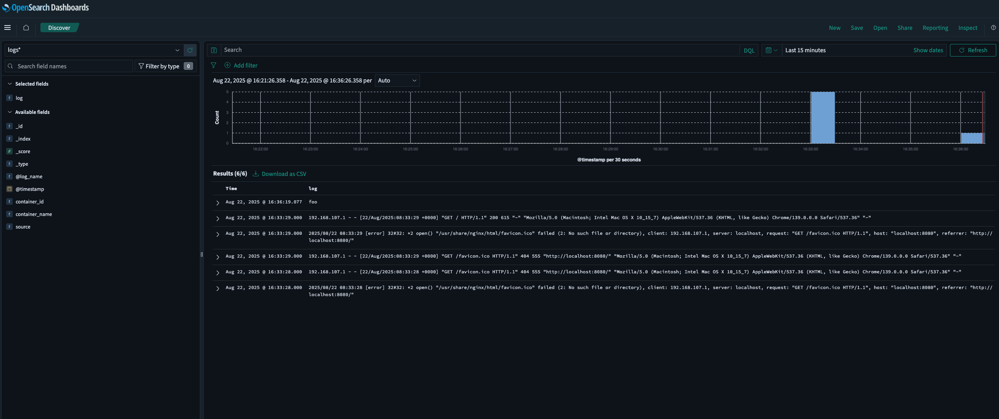

# Fluentd to OpenSearch

Collect application logs using Fluentd and send them to OpenSearch.



## Components

- **Fluentd**: Log collector that forwards logs to OpenSearch
- **OpenSearch**: Open-source search and analytics platform
- **OpenSearch Dashboards**: Visualization and management interface
- **Demo App**: Nginx container that generates sample logs

## Quick Start

1. Start the entire stack:
```bash
docker-compose up -d
```

2. Generate some logs by:
```bash
# visiting the demo app
curl http://localhost:8080

# send log via fluentd
curl -X POST -d 'json={"log":"foo"}' http://localhost:9880/app.log
```

3. View logs in OpenSearch Dashboards:
   - Open `http://localhost:5601`
   - Navigate to "Discover" to view logs
   - Create index patterns for the `logs` index

4. Search logs in OpenSearch:
   - Use query DSL or simple search queries
   - Example: search for `log:"foo"` in the Discover interface

## Services & Ports

| Service | Port | Description |
|---------|------|-------------|
| Demo App | 8080 | Nginx demo application |
| Fluentd | 24224 | Log collection endpoint |
| OpenSearch | 9200 | OpenSearch API endpoint |
| OpenSearch Dashboards | 5601 | Web interface for visualization |

## Configuration

- **Fluentd**: Configured to receive logs on port 24224 and forward to OpenSearch
- **Demo App**: Uses Fluentd logging driver to send logs
- **OpenSearch**: Configured to store logs in the `logs` index
- **OpenSearch Dashboards**: Provides web interface for log visualization and analysis
