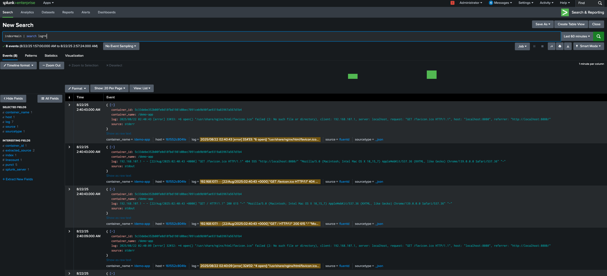

# Fluentd to Splunk HEC

Collect application logs using Fluentd and send them to Splunk HEC.



## Components

- **Fluentd**: Log collector that forwards logs to Splunk HEC
- **Splunk**: Log aggregation and analysis platform
- **Demo App**: Nginx container that generates sample logs

## Quick Start

1. Start the entire stack:
```bash
docker-compose up -d
```

2. Generate some logs by:
```bash
# visiting the demo app
curl http://localhost:8080

# send log via fluentd
curl -X POST -d 'json={"message":"foo"}' http://localhost:9880/app.log
```

3. View logs in Splunk:
   - Login with `admin:password`
   - Configure HEC(HTTP Event Collector)
     - Settings > Data Inputs > HTTP Event Collector
     - Set default index to main
   - Navigate to search
     - Apps > Search & Reporting
   - Open `http://localhost:8000`

4. Search logs in Splunk:
   - Use search queries like: `index=main` or `index=main | search message="foo"`

## Services & Ports

| Service | Port | Description |
|---------|------|-------------|
| Demo App | 8080 | Nginx demo application |
| Fluentd | 24224 | Log collection endpoint |
| Splunk | 8000 | Splunk web interface |
| Splunk HEC | 8088 | HTTP Event Collector endpoint |

## Configuration

- **Fluentd**: Configured to receive logs on port 24224 and forward to Splunk HEC
- **Demo App**: Uses Fluentd logging driver to send logs
- **Splunk**: Configured with HEC token for receiving logs
